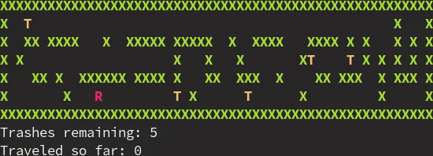

# Trash-collecting robot problem
Given a maze with robot R and trashes T,
the goal for the robot is to collect all the trashes walking the shortest route possible.

    

 

## Usage
`./run.sh <input_path> <approach_number>`
        
Approaches:
1. greedily to the closest trash using BFS
2. optimally using A* - minimum spanning tree heuristic
3. optimally using A* - furthest trash plus remaining trashes heuristic
4. optimally using A* - nearest trash heuristic
5. optimally using A* - remaining trashes heuristic
6. optimally using A* - zero heuristic

Sample call:
`./run.sh test/2.txt 2`

## Approaches

### Greedy BFS
A state space is just the input encoded as a graph.
A state in the state space is a position of the robot.

Using the BFS, the robot finds the nearest trash and goes for it.
This process is repeated until all trashes are collected.

### Optimal A*
A state in a state space is a position of the robot AND a list of remaining trashes.

The optimal solution is found but the number of opened states is dependent on chosen heuristic.

Because I use a custom A* implementation, there is no need to hold the whole state space in memory
(which in case of the MST heuristic would be O(|maze| * |T|!) states).
There is only an `opened` collection of opened states,
which is typically relavitely small thanks to the use of heuristic.

#### Implemented heuristics
1. minimum spanning tree heuristic

Returns a weight of a minimum spanning tree of a complete graph of the remaining trashes and the robot,
where edge weights are lengths of the shortest paths between corresponding pairs. 

Edge weights of the complete graph are computed using Dijkstra algorithm (`nx.shortest_path` library implementation) (Since |T| << |maze|, the Floyd–Warshall algorithm would probably take longer.) and the minimum spanning tree is constructed using Kruskal algorithm (`nx.minimum_spanning_tree` library implementation).

2. furthest trash plus remaining trashes heuristic

Returns a distance to the furthest remaining trash plus number of remaining trashes.

3. nearest trash heuristic

Returns a distance to the nearest remaining trash.

4. remaining trashes heuristic

Returns a number of remaining trashes.

5. zero heuristic

Returns zero constantly.

A* essentially became a BFS.

## Performance

### Maze 1
| approach               | route length | states opened |
|------------------------|--------------|---------------|
| greedy BFS             | 128          | 1 825         |
| optimal A* - MST       | 128          | 1 113         |
| optimal A* - furth+rem | 128          | 20 628        |
| optimal A* - nearest   | 128          | 34 037        |
| optimal A* - rem       | 128          | 42 700        |
| optimal A* - zero      | 128          | 43 153        |

### Maze 2
| approach               | route length | states opened |
|------------------------|--------------|---------------|
| greedy BFS             | 79           | 378           |
| optimal A* - MST       | 62           | 215           |
| optimal A* - furth+rem | 62           | 515           |
| optimal A* - nearest   | 62           | 1 876         |
| optimal A* - rem       | 62           | 2 665         |
| optimal A* - zero      | 62           | 2 757         |

### Maze 3
| approach               | route length | states opened |
|------------------------|--------------|---------------|
| greedy BFS             | 184          | 3 056         |
| optimal A* - MST       | 163          | 895           |
| optimal A* - furth+rem | 163          | 106 744       |
| optimal A* - nearest   | 163          | 441 134       |
| optimal A* - rem       | 163          | 577 295       |
| optimal A* - zero      | 163          | 603 446       |

### Maze 4
| approach               | route length | states opened |
|------------------------|--------------|---------------|
| greedy BFS             | 16           | 32            |
| optimal A* - MST       | 11           | 34            |
| optimal A* - furth+rem | 11           | 47            |
| optimal A* - nearest   | 11           | 63            |
| optimal A* - rem       | 11           | 63            |
| optimal A* - zero      | 11           | 70            |
