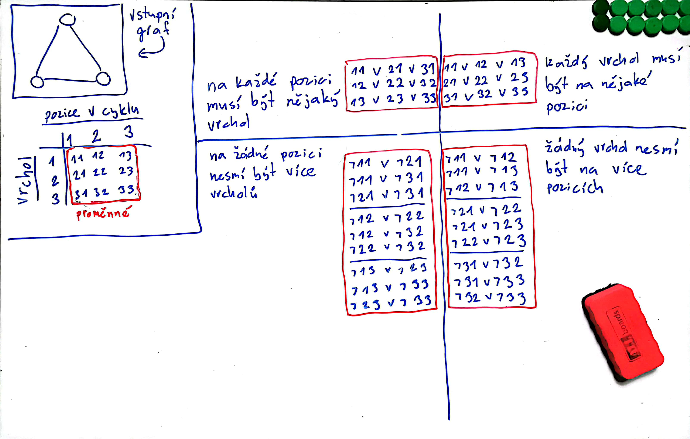

# Hledání Hamiltonovské kružnice v grafu převodem na instanci SAT problému a následné vyřešení pomocí SAT řešice

### Jak spustit

Vytvoření Python virtuálního prostředí
```
> python3 -m venv lab03-venv
```

Aktivace Python virtuálního prostředí
```
> source lab03-venv/bin/activate
```

Nainstalování potřebných knihoven
```
> pip3 install -r requirements.txt
```

Spuštění
```
> python3 src/find_hamiltonian_cycle.py < inputs/house.graph
```

### Jak to funguje

Skript `src/find_hamiltonian_cycle.py` dostane na standardním vstupu neorientovaný graf, kde:
- první řádek je ve formátu "`pocet_vrcholu` `pocet_hran`"
- dalších `pocet_hran` řádků určuje hrany grafu a jsou ve formátu "`vrchol_1` `vrchol_2`"

Skript nejdříve načte vstupní graf a uloží ho jako graf z knihovny `networkx` (není vyloženě potřeba).

Dále graf převede na instanci SAT problému s využitím těchto faktů:
- máme `pocet_vrcholu` vrholů a každý může být na jedné z `pocet_vrcholu` pozic, tedy celkem budeme mít `pocet_vrcholu`^2 výrokových proměnných
- na každé pozici musí být nějaký vrchol
- každý vrchol musí být na nějaké pozici
- na žádné pozici nesmí být více vrcholů
- žádný vrchol nesmí být na více pozicích
- pokud v grafu nejsou dva vrcholy sousedé, tak nemohou být ani na sousedních pozicích v Hamiltonovské kružnici

Zde je ukázková transformace pro graf K_3:


Následně skript nad SAT instancí v DIMACS formátu zavolá řešič *Glucose4* z knihovny `pysat` v pomocném skriptu `solve_SAT`.

Výsledek ze SAT řešice poté interpretuje zpět v jazyce vstupního grafu.

Na závěr už jen uloží všechny zajímavé informace do složky `outputs`, konkrétně:
- reprezentaci instance problému existence Hamiltonovské kružnice vstupního grafu jako instanci SAT problému ve formátu DIMACS v souboru s příponou `.sat`
- ohodnocení proměnných nalezené SAT řešičem v souboru s příponou `.solution_sat`
- posloupnost vrcholů vstupníího grafu definující Hamiltonovskou kružnici v souboru s příponou `.solution_graph`
- vizualizace vstupního grafu a jeho Hamiltonovské kružnice v souboru s příponou `.png`

Pokud vstupní graf Hamiltonovskou kružnici nemá, skript skončí s chybou.

---

Ve složce `inputs` jsou dva ukázkové vstupy, pro které jsou ve složce `outputs` předpočítané výsledky.
