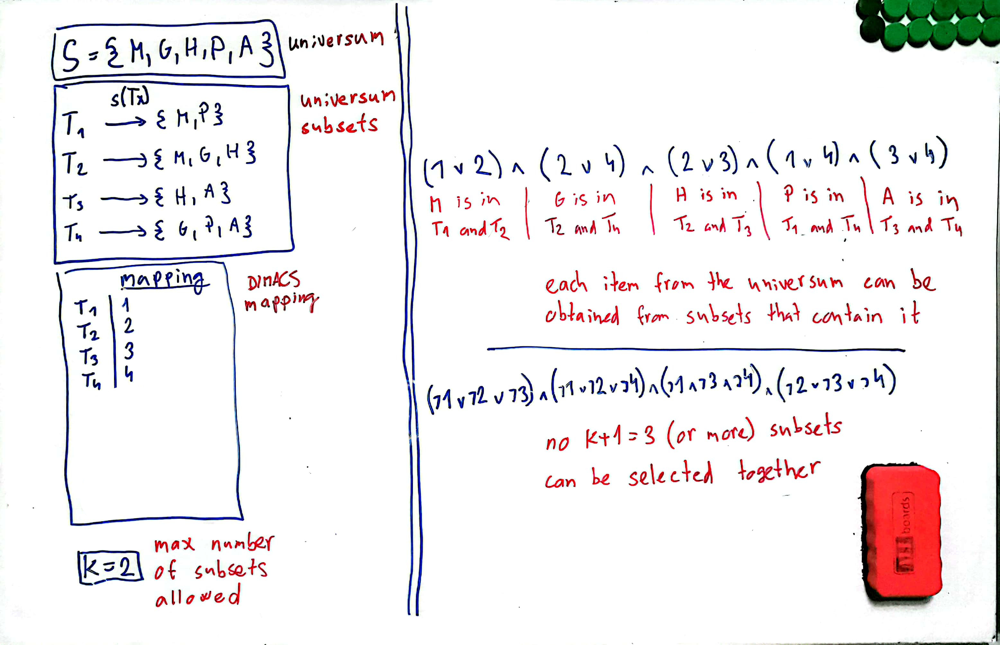

# Hledání pokrytí předmětů učiteli

Jedná se o alternativní formulaci [Set cover problému](https://www.wikiwand.com/en/Set_cover_problem), kde množina předmětů `S` je univerzum, které se snažíme pokrýt a zobrazení `S(t)` pro `t` z `T` tvoří systém `P` podmnožin univerza `S`, jehož sjednocením získáme celé univerzum.

Otázkou poté je, zdali pro zadané číslo `k` dokážeme najít nanejvýš `k` podmnožin `S` z `P` tak, abychom jejich sjednocením získali celé `S`.

---

Úlohu budeme řešit převodem na instanci SAT problému a následným vyřešením SAT řešičem.

Na obrázku níže je vidět ukázková vstupní instance a její převod do CNF.



Obecně je transformace provedena následovně:
- chceme zjistit, jaké podmnožiny z `P` vybrat, takže za každou podmnožinu vytvoříme jednu výrokovou proměnnou
    - kladně ohodnocené proměnné budou reprezentovat podmnožiny, které máme vybrat
- chceme, aby každý prvek z `S` byl v nějaké podmnožině, takže za každý prvek vytvoříme jednu klauzuli, jejíž splnění bude indikovat, že byla vybrána podmnožina, která daný prvek obsahuje
    - v klauzuli pro prvek `s` z univerza budou proměnné reprezentující ty podmnožiny `P`, ve kterých se `s` nachází
- chceme, aby bylo vybráno maximálně `k` podmnožin, takže pro každou (`k+1`)-prvkovou kombinaci znegovaných proměnných vytvoříme jednu klauzuli, čímž zajistíme, že nikdy nebude vybráno více než `k` podmnožin najednou

## Implementace

### Jak spustit

Vytvoření Python virtuálního prostředí
```
> python3 -m venv lab03-venv
```

Aktivace Python virtuálního prostředí
```
> source lab03-venv/bin/activate
```

Nainstalování potřebných knihoven
```
> pip3 install -r requirements.txt
```

Spuštění
```
> python3 find_set_cover.py < inputs/1.in
```

### Jak to funguje

Skript dostane na stdin vstupní instanci ve formátu:
- první řádka obsahuje kladné celé číslo `k`, tedy kolik maximálně podmnožin z `P` může být součástí řešení 
- druhá řádka obsahuje prvky univerza oddělené mezerou
- každá další řádka obsahuje nějakou podmnožinu prvků univerza oddělených mezerou

Poté tento vstup zpracuje a data si předpřipraví do datových struktur tak, aby následné sestrojení CNF bylo možné provést efektivně.

Dále sestrojí CNF výrokovou formuli v DIMACS formátu podle popisu výše a pošle jí `Glucose4` SAT solveru z knihovny `pysat` v pomocném skriptu `solve_SAT`.

Nakonec už jen vypíše formuli a výsledné ohodnocení na stdout, přičemž interpretace takového ohodnocení je popsána výše.