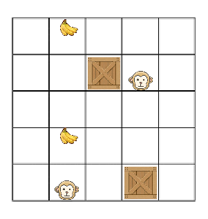
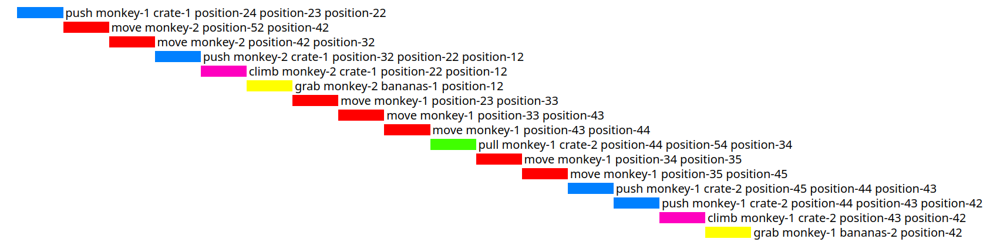
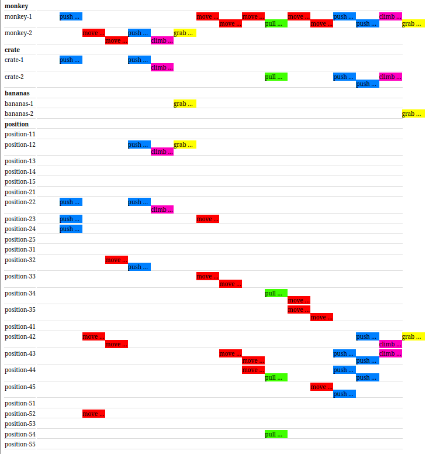
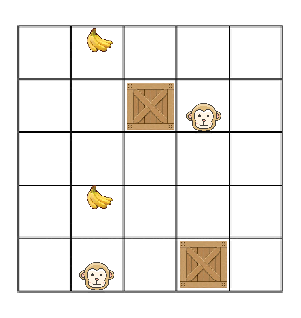

# 2D MONKEY AND BANANAS / SIMPLE SOKOBAN

There is a 2D rectangular room with monkeys, crates and bananas inside.
The goal for the monkeys is to get all the bananas with the use of the crates.

As I work with a 2D variant of the problem, it is essentially a modified version of the Sokoban, where there are no walls, but, on the other hand, climbing on crates and multiple monkeys are possible.

My implementation supports multiple monkeys, crates and bananas and also a rectangular grid of any size.
Monkeys can cooperate, however, they cannot work in parallel (like there is just one agent controlling all of them).

This project is an implementation of tasks **3.a**, **3.c** and **6.b** with a little extra.

---

I have described the problem as a PDDL domain in the file `inputs/monkey-and-bananas.pddl`.

I have then created a Python script `transform-to-pddl.py`, which takes a problem instance in the format of a 2D ASCII image and translates it into a PDDL problem file.
A sample script input can be found in the file `inputs/sample-problem.input`, together with the PDDL output of the script in the file `inputs/sample-problem.pddl`, which I have formatted a little bit to be more readable.

I have then solved the `sample-problem` using two PDDL planners, for which details can be seen down below.

Also note that there is the script `solve.py`, which automatically transforms the ASCII image on the input to PDDL and solves it, with a plan stored in a file called `sas_plan`.

---

There is also a Python library [The AIPlan4EU Unified Planning Library](https://github.com/aiplan4eu/unified-planning), which offers a unified and concrete-planner-independent interface to describe and solve planning problems directly in Python. It would also be interesting to explore it more.


---

### Solution 1

I used an [online PDDL planning service](https://solver.planning.domains/solve) through the [VS Code PDDL extension](https://github.com/jan-dolejsi/vscode-pddl).

A run info for the `sample-problem` can be found in [outputs/solution_1/sample-problem.run](outputs/solution_1/sample-problem.run).

A plan for the `sample-problem` can be found in [outputs/solution_1/sample-problem.plan](outputs/solution_1/sample-problem.plan).

A visualization of the plan:





### Solution 2 

I used a planner called [Scorpion](https://github.com/ipc2023-classical/planner25), which was the second-best planner on the [Classical Optimal Track](https://ipc2023-classical.github.io/#optimal-track) at the [International Planning Competition 2023](https://ipc2023.github.io/).
 
The planner is an extension of the [Fast Downward](https://www.fast-downward.org/) planner and it was run with the recommended configuration (see the file `scorpion.sh`).

The planner can be found in the directory `scorpion`.

A run info for the `sample-problem` can be found in [outputs/solution_2/sample-problem.run](outputs/solution_2/sample-problem.run).

A plan for the `sample-problem` can be found in [outputs/solution_2/sample-problem.plan](outputs/solution_2/sample-problem.plan).

We can see that the solution found by Scorpion is shorter (and the shortest possible) than the solution found by the previous planner.

A visualization of the plan:



---

### How to run

To translate the `sample-problem` input file into a PDDL problem description:
```
python transform_to_pddl.py < inputs/sample-problem.input
```

To get a direct solution for the `sample-problem` input file in the `sas_plan` output file:
```
python solve.py < inputs/sample-problem.input
```

---

### TODO

- enable monkeys to climb down from a crate
- add support for walls
